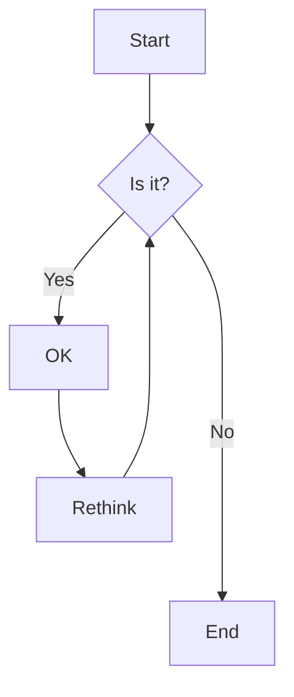

# GPTCat

Little extension to render `Lᴬ𝜯𝛦χ` and `mermaid` on [claude.ai](http://claude.ai).

## Installation

1. `git clone git@github.com:lumpenspace/xlaude.git`
2. `npm install -g yarn`
3. `yarn install`
4. `yarn build`
5. Open `chrome://extensions/` in your browser
6. Enable `Developer mode`
7. Click `Load unpacked`
8. Select this directory
9. Open the claude.ai website
10. Enjoy the rendered math

## Usage

1. Open the claude.ai website;
2. Tell claude that he can  now render maths, by including Lᴬ𝜯𝛦χ code into `<lx>tags</lx>` (he prefers XML);
3. Enjoy the rendered math
<<<<<<< HEAD
=======

## Latest Release

Download the latest version of the app from the [latest release](https://github.com/lumpenspace/claudex/latest).

>>>>>>> 6cdddfa1e5176ee2d02fc654b9183314c95483d0
